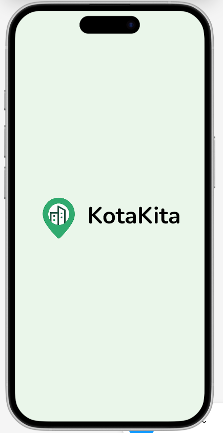
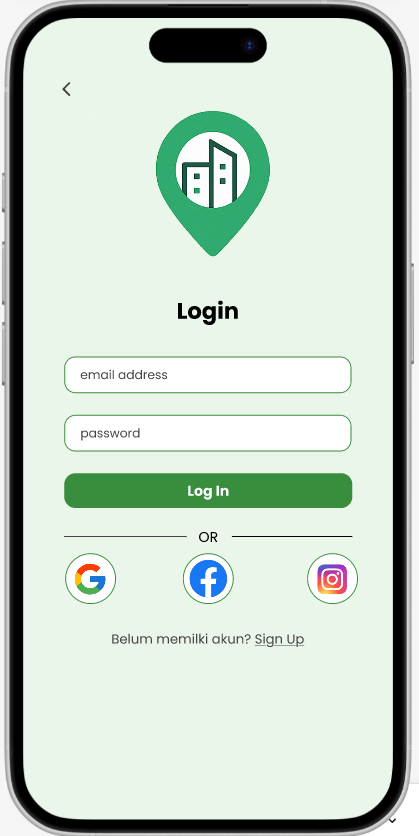
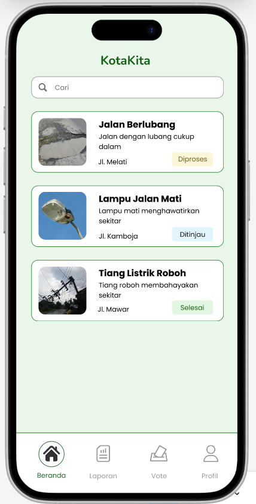
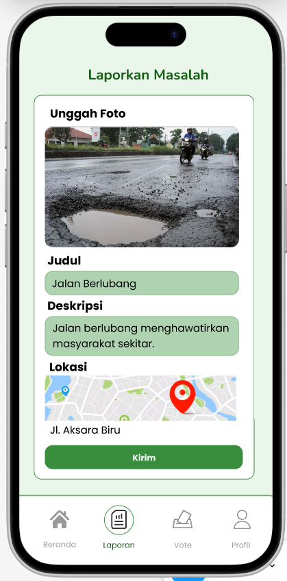
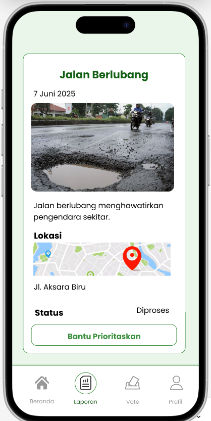
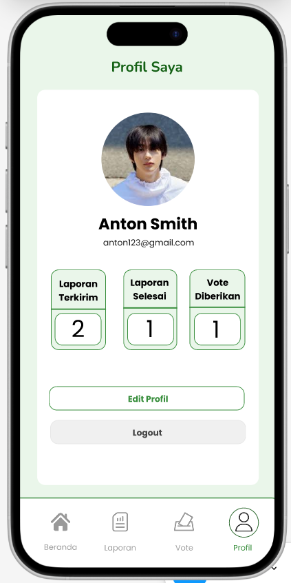

# KotaKita — Mobile App UI/UX Design 📱

---

## ✨ About the Project

**KotaKita** is a mobile app concept designed to help users report damage to public facilities such as roads, streetlights, and other public infrastructures.  
The app aims to make it easier for communities to participate in improving city environments through a simple and intuitive interface.

---

## 🎨 Tools Used
- Figma

---

## 🖼 Preview Screens

| Splash Screen | Login/Sign Up | Home Screen |
|--------------|---------------|-------------|
|  |  |  |

| Report Issue | Report Detail | Profile (Optional) |
|-------------|---------------|--------------------|
|  |  |  |

---

## 🔑 Key Features
- 📌 Report public facility damages easily
- 📝 Add descriptions, photos, and location details
- 📊 View history of submitted reports
- 👤 Personalized user profile

---

## 🔗 Live Prototype
👉 [View Figma Prototype](https://www.figma.com/proto/QxW6MfEeDEnwLRGVFvtz5m/KotaKita?node-id=0-1&t=MT5dbaiRoYP2kXU3-1)

---

## 💡 What I Learned
- Designing clear, minimalistic user flows
- Balancing visual hierarchy and accessibility
- Applying consistent color schemes & iconography

---

Designed by **[ReginaKirana](https://github.com/ReginaKirana)**