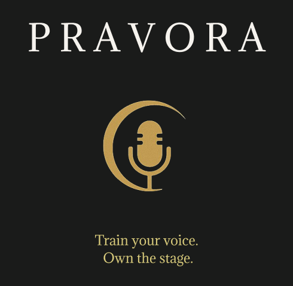
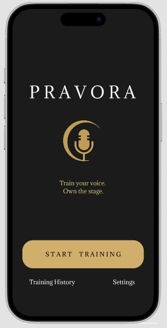
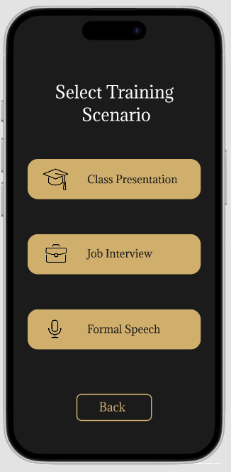
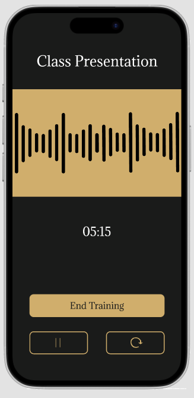
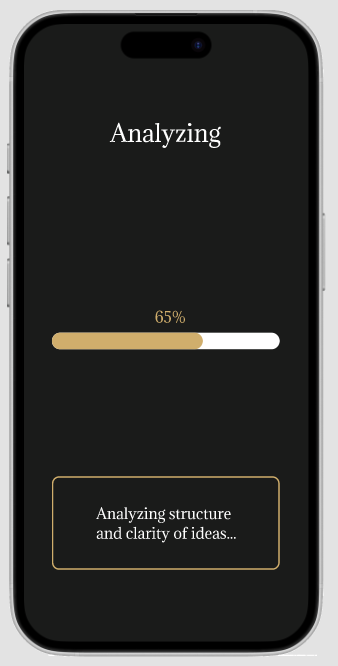
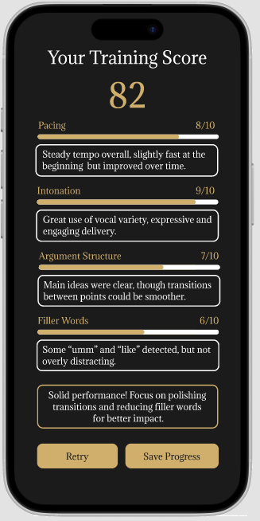
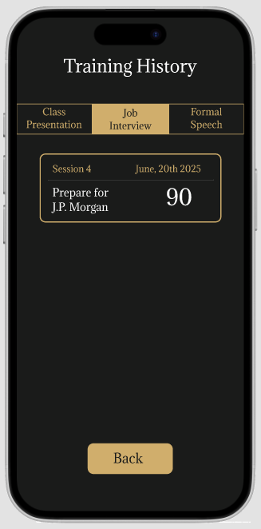

# Pravora — AI-Powered Public Speaking Training 🎤✨

---

## ✨ About the Project

**Pravora** is a mobile app designed to help users improve their **public speaking skills** through **AI-powered feedback**. Users can choose different training modes and receive personalized insights to enhance their communication.

This app targets **students, job seekers, professionals, and anyone looking to sharpen their speaking abilities**.

---

## 🎨 Tools Used
- Figma
- AI Concepts (Speech Processing, NLP, Emotion Detection)

---

## 🖼 Preview Screens

| Home | Select Mode | Recording |
|------|-------------|-----------|
|  |  |  |

| Analyzing | Score Result | Training History |
|-----------|--------------|------------------|
|  |  |  |

---

## 🔑 Key Features

- 🎙 **Speech Recording & Playback**
- 🤖 **Real-time AI Analysis**
  - Filler words detection
  - Intonation and pacing feedback
  - Confidence & relevance scoring
- 🏆 **Adaptive Scoring System**
  - Mode-specific feedback (Presentation, Interview, Formal Speech)
- 📈 **Progress Tracking**
  - Save and review past performances

---

## 🧠 AI Technologies Used

| Feature | Technology |
|---------|------------|
| Speech Processing & NLP | Automatic Speech Recognition (ASR), Text Classification |
| Voice Emotion Detection | Prosodic Feature Analysis, Deep Learning (CNN) |
| Adaptive Scoring | Rule-based + Machine Learning Regression |
| Personalized Feedback | User Profiling, Reinforcement Learning (RL) |

---

## 🔗 Live Prototype
👉 [View Figma Prototype](https://www.figma.com/proto/DJEtniy8aqBtJEuReTS4SQ/Pravora_Regina?node-id=0-1&t=125NLlCkt4Pkta8L-1)

---

## 💡 What I Learned

- Combining **UX design** with **AI concepts** for impactful applications.
- Designing for **adaptive feedback** and **personal growth tracking**.
- Applying consistent dark-themed visual aesthetics with gold accents.

---

Designed by **[ReginaKirana](https://github.com/ReginaKirana)**