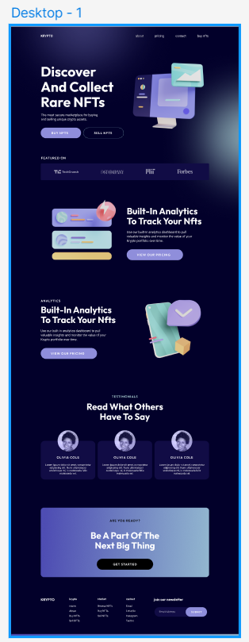
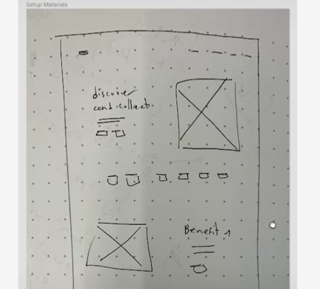
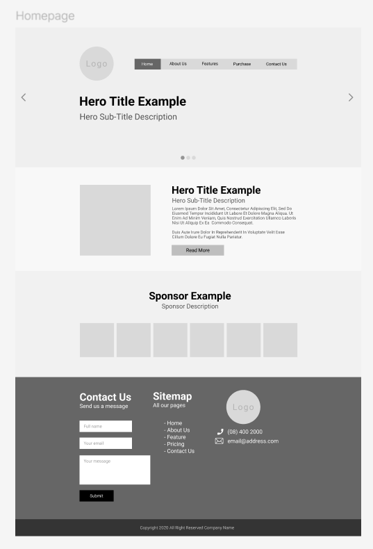
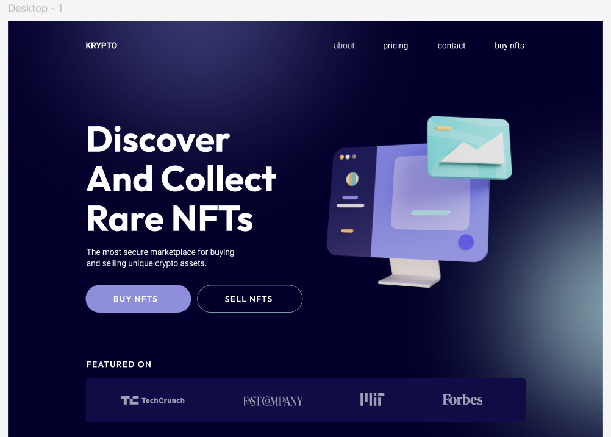
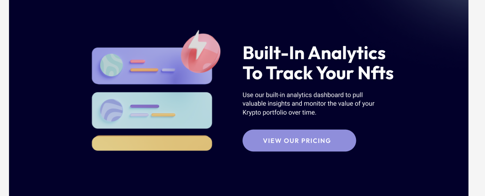
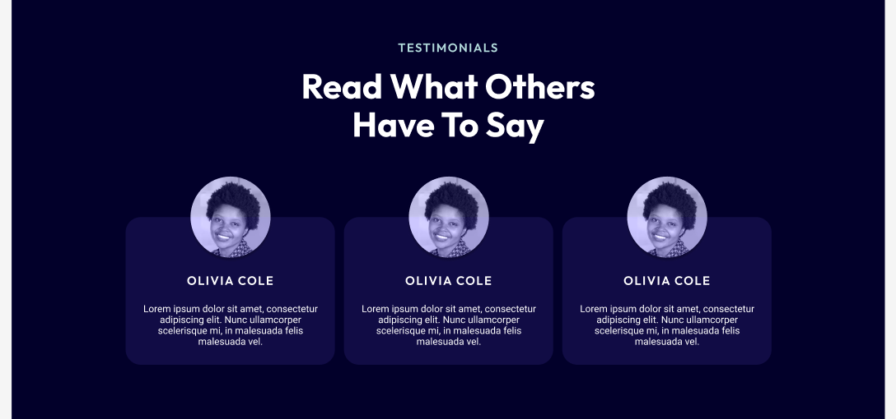
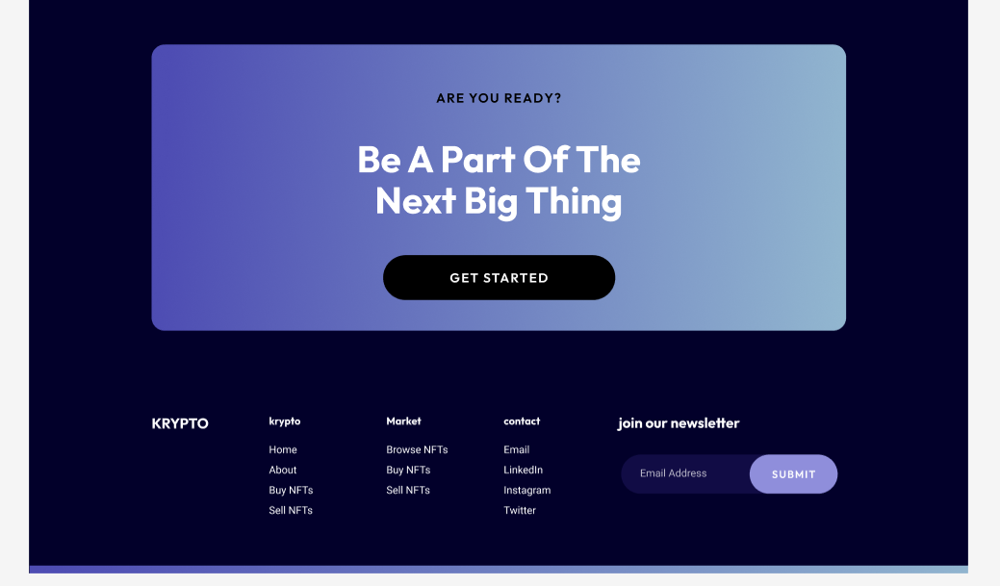

# NFT Landing Page — Desktop UI/UX Design 💻🎨

---

## ✨ About the Project

This is a concept design for a **desktop landing page** focused on NFTs (Non-Fungible Tokens). The landing page is designed to help users **discover, collect, and sell rare NFTs** while highlighting powerful features like **built-in analytics** and **community testimonials**.

The design combines futuristic gradients, clean layout, and clear CTAs to encourage user interaction and trust.

---

## 🎨 Tools Used
- Figma
- Pen & Paper (Sketch)
- Wireframe Tool (Digital)

---

## 🧠 Design Process

| ✏️ Initial Sketch | 💻 Digital Wireframe |
|-------------------|----------------------|
|  |  |

---

## 🖼 Final UI Preview

| Full Desktop Landing Page |
|---------------------------|
|  |

---

## 🧩 UI Detail Preview

| Hero & Features | View Pricing | Analytics | Testimonials | Get Started & Footer |
|-----------------|--------------------------|--------------|----------------------|
|  |  |  |  |  |

---

## 📌 Key Sections in the UI

- 🚀 **Hero Section**  
  Bold headline with CTA buttons like “Buy NFTs” and “Sell NFTs”

- 📰 **Featured On**  
  Logos from known media sources for credibility

- 📊 **Analytics Section**  
  Explains tracking tools and user insights for NFT activity

- 💬 **Testimonials**  
  Real user feedback to build trust

- 📣 **Final Call to Action**  
  Motivates user to get started and be part of the movement

- 🦶 **Footer**  
  Contains navigation and newsletter subscription

---

## 💡 What I Learned

- Designing modern landing pages with structured hierarchy
- Making sure each section leads to action or engagement
- Managing consistent UI components and color schemes
- Enhancing readability and visual balance for desktop screen

---

📁 **Assets Folder Structure:**